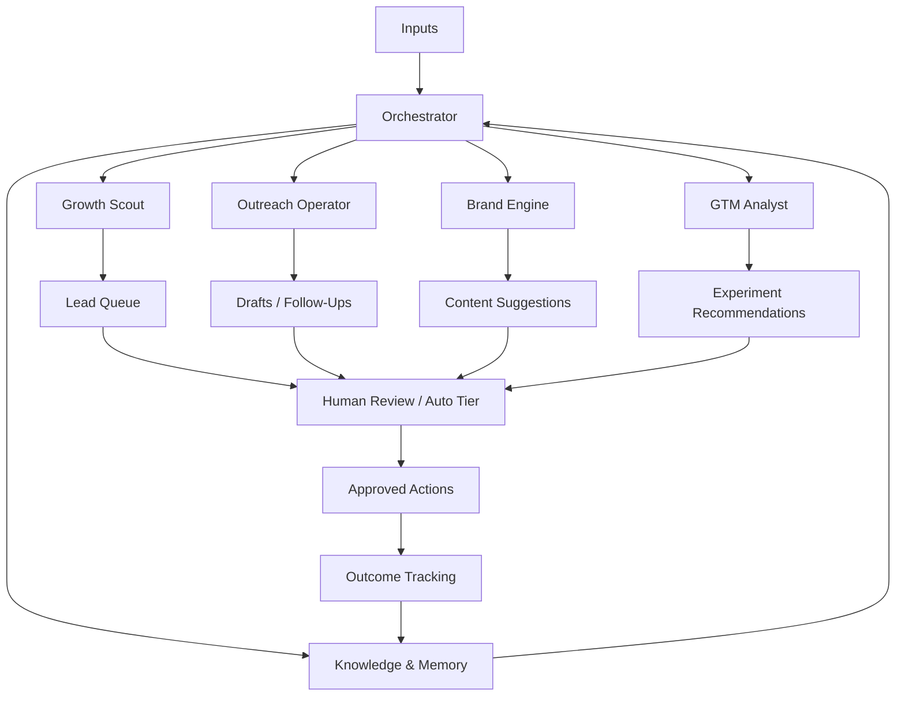

# BaseDare Brain Architecture

Related docs:
- [BaseDare Brain System Prompt Spec](./basedare-brain-system-spec.md)
- [BaseDare Brain Tools, Permissions, and Scorecards](./basedare-brain-ops-spec.md)
- [BaseDare Brain Memory Schema](./basedare-brain-memory-schema.md)

## Purpose

BaseDare Brain is a growth-focused operator layer for the company.

It is not a fake autonomous founder. It is a structured agent system that:
- researches
- prioritizes
- drafts
- follows up
- learns from outcomes
- proposes product and GTM actions

The human team still owns final judgment for brand, money, legal risk, and partner trust.

## Core Goal

Increase BaseDare growth by improving:
- creator acquisition
- venue acquisition
- brand reach
- campaign opportunities
- product learning

## Current Product Sequencing

The current marketplace build order is intentionally:
1. Control foundation
2. Social Connect
3. Creator enrichment
4. Campaign requirements
5. Matching
6. Shadow Army expansion

This order matters because BaseDare should create real demand pull before adding more routing/admin complexity.

## Current Marketplace Rules

- Creator pull comes before Shadow Army expansion.
- Soft matching comes before strict qualification gates.
- While creator density is low, campaign requirements should guide ranking instead of filtering creators out.
- Brand shortlists are internal operator signals, not public Pulse or place-energy signals.
- `Connect Identity` means linking the creator handle a person actually uses to their wallet.
- `Connect Identity` is multi-platform and manual-first for now:
  - Instagram
  - TikTok
  - YouTube
  - X
  - Other
- Creator identity should reuse the existing tag + admin-review rails instead of introducing a second identity system.
- The app should derive one clear primary creator identity from the existing tag rail and show that same primary handle consistently across dashboard, claim flow, profile, and creator APIs.
- OAuth is optional future enrichment, not the core trust rail for creator onboarding right now.
- Pending identity proofs should still let creators continue through the product; verification should strengthen trust, not block first use.
- Creator opportunity context should carry through dashboard, map, and venue surfaces so a matched activation stays in focus instead of becoming a generic place view.
- Control should show operator-visible activation outcomes per campaign, including creator movement, proof progression, and payout state, not just campaign status labels.
- The public `/verify` queue is a community-signal lane only. Once proof escalates into `PENDING_REVIEW`, it should leave public voting and sit in referee/admin review instead of living in both states at once.
- Admin review should show campaign and venue context alongside proof freshness so operators can resolve activations quickly without jumping across disconnected surfaces.
- Telegram should mirror the real operator handoff points, not every intermediate state. Claim requests, tag moderation decisions, and proof escalations into admin review should alert operators; passive browsing states should not.
- Review ops should prioritize the hottest proofs first: already-escalated referee items, campaign-backed activations, and aging proofs should rise to the top. Control should mirror that same lifecycle with a compact recent-movement readout instead of only static status pills.
- The same demand graph should power both sides:
  - Brand creates campaign
  - campaign creates linked dare
  - creator sees opportunity
  - creator claims linked dare
  - creator submits proof
  - verification settles
  - place memory compounds

## Design Principles

1. The brain should optimize for measurable business outcomes, not activity theater.
2. It should be proactive, but bounded.
3. It should have strong memory and weak ego.
4. It should escalate high-risk actions instead of bluffing confidence.
5. It should prefer consistent loops over “autonomous genius” behavior.

## System Overview

## Main Components

### 1. Orchestrator

The Orchestrator is the planning layer.

Responsibilities:
- read goals and scorecards
- decide what matters today
- route work to specialist modules
- keep actions within permission boundaries
- summarize results
- request human approval when needed

### 2. Growth Scout

Responsibilities:
- discover venue prospects
- discover creator prospects
- monitor local scenes and cities
- identify sponsor/event opportunities
- rank leads by likelihood and importance

Outputs:
- lead lists
- priority rankings
- city opportunity maps
- partner watchlists

### 3. Outreach Operator

Responsibilities:
- draft DMs and emails
- personalize outreach
- manage follow-up cadence
- track outreach state
- summarize objections and replies

Outputs:
- ready-to-review outreach drafts
- follow-up plans
- response summaries

### 4. Brand Engine

Responsibilities:
- watch what messaging performs
- propose posts and campaigns
- maintain voice consistency
- identify angles that resonate
- refine positioning

Outputs:
- X post drafts
- short campaign concepts
- narrative shifts
- brand-language updates

### 5. GTM Analyst

Responsibilities:
- analyze product usage and funnel data
- connect growth problems to product problems
- propose experiments
- track experiment results
- surface market signals

Outputs:
- weekly GTM reports
- experiment recommendations
- bottleneck summaries

### 6. Knowledge & Memory Layer

Responsibilities:
- store contact histories
- store venue intelligence
- store creator intelligence
- store outreach outcomes
- store messaging wins/losses
- store reusable insights

Without this, the brain resets every day and behaves like a glorified autocomplete system.

## Input Sources

### Internal
- CRM or lead sheet
- outreach history
- venue lists
- creator lists
- product analytics
- app database summaries
- Telegram alerts
- internal notes and docs

### External
- X and creator activity
- venue websites and socials
- event listings
- city nightlife and culture sources
- partner or sponsor websites

## Output Types

BaseDare Brain should mainly produce:
- prioritized lead queues
- outreach drafts
- follow-up reminders
- city-level opportunity reports
- creator shortlists
- daily and weekly brand suggestions
- GTM experiment proposals
- summaries of what is working and what is not

## Operating Loop

### Daily loop
1. ingest new signals
2. update lead and opportunity rankings
3. propose actions
4. execute low-risk actions automatically
5. send high-risk actions for review
6. log outcomes
7. update memory

### Weekly loop
1. review scorecard changes
2. identify top wins and failures
3. update outreach strategies
4. update target-city and target-venue priorities
5. recommend product and GTM experiments

## Action Tiers

### Auto
- research
- list building
- monitoring
- deduping leads
- draft generation
- lightweight summarization

### Human review required
- public posts
- outbound partner outreach
- creator outreach
- pricing or perk proposals
- campaign offers

### Human only
- contracts
- payments
- legal commitments
- treasury actions
- high-risk brand statements

## Memory Design

The memory layer should track:

### Venue memory
- venue name
- location
- category
- contact paths
- outreach status
- notes
- objections
- event windows

### Creator memory
- handle
- niche
- city
- audience fit
- prior interactions
- response quality
- collaboration potential

### Messaging memory
- what copy got replies
- what copy got ignored
- what offers converted
- what positioning caused confusion

### Product/GTM memory
- friction points
- common objections
- recurring feature requests
- market signals

## Success Conditions

BaseDare Brain is working if it:
- helps the team close more real conversations
- improves follow-up consistency
- shortens research time
- surfaces better opportunities than manual browsing alone
- creates a usable memory of growth activity

It is not working if it:
- produces lots of output but no movement
- spams low-quality outreach
- keeps changing brand voice
- takes risky actions without approval

## Recommended Initial Version

### Brain v1
- single orchestrator
- growth scout
- outreach operator
- brand engine
- simple memory store
- human approval inbox

This is enough to create leverage without pretending to be a full autonomous company.

## Future Extensions

Later additions could include:
- venue-specific partner agent
- creator relationship agent
- sponsorship or campaign agent
- city launch planner
- product telemetry interpreter

The system should start narrow and earn its autonomy over time.
