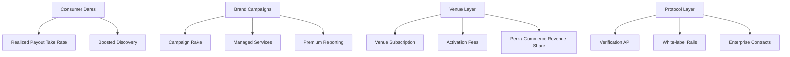

# BaseDare Revenue Architecture

## Core Thesis

BaseDare should not be modeled as a single-revenue-stream dare app.

It should be modeled as a stacked business with four layers:

1. consumer challenge liquidity
2. brand and campaign operating system
3. venue and city operating system
4. protocol and verification infrastructure

The biggest mistake would be treating all gross volume as company revenue.

## Non-Negotiable Financial Rule

Separate these clearly:

- company revenue
- creator payout
- referral or scout rake
- community treasury or live pot
- refunded volume

If these are mixed together in internal dashboards, the business will look healthier than it really is.

## The Four Revenue Layers

### 1. Consumer Layer

What it is:
- fans or users fund dares
- creators complete or fail them
- BaseDare earns only when the payout path resolves successfully

Why it matters:
- creates spectacle
- creates creator supply
- creates content loops
- creates social proof
- creates top-of-funnel demand

Best monetization:
- take rate on successful payouts
- boosted dare placement
- premium dare visibility
- creator challenge subscriptions later

Limits:
- weak as a standalone business if average dare values stay low
- refund and failure rates can crush realized revenue
- moderation cost can erase margin

Role in the business:
- growth engine first
- revenue engine second

### 2. Campaign Layer

What it is:
- brand-funded creator challenges
- timed challenges
- sync-window campaign missions
- verified content outcomes

Why it matters:
- higher budgets
- stronger willingness to pay
- less random than consumer demand
- better justification for verification and reporting

Best monetization:
- setup fee
- campaign rake
- managed service fee
- reporting package
- premium review / QA / compliance support

Role in the business:
- primary near-term revenue engine

### 3. Venue Layer

What it is:
- venue pages
- venue console
- venue check-ins
- venue memory
- venue perks and event activation

Why it matters:
- recurring revenue potential
- real-world moat
- repeat traffic
- place-based network effects

Best monetization:
- venue software subscription
- one-off activation packages
- district sponsorships
- perk redemption revenue share
- local leaderboard or traffic packages

Role in the business:
- secondary revenue engine that becomes much stronger after check-in and foot-traffic proof

### 4. Protocol Layer

What it is:
- proof validation
- challenge settlement
- venue secure handshakes
- reusable challenge rails for partners

Why it matters:
- highest long-term leverage
- can move BaseDare from app to platform
- unlocks API and enterprise revenue

Best monetization:
- API pricing
- verification-as-a-service
- white-label or infrastructure contracts
- enterprise settlement and reporting

Role in the business:
- long-term platform upside

## Revenue Map

## What Should Count As Revenue

Should count:
- platform rake sent to company wallet
- setup fees
- recurring venue subscriptions
- managed-service revenue
- enterprise or API contract revenue

Should not count:
- full funded GMV
- creator payouts
- refunded volume
- live pot or community treasury balances
- referral payouts

## Margin Profile By Layer

### Consumer

Gross margin potential:
- medium

Why:
- payment rail cost is low
- moderation and support cost can still be high

Main risk:
- too much manual review for too little bounty value

### Campaigns

Gross margin potential:
- high

Why:
- larger contracts
- can bundle services
- better pricing power

Main risk:
- sales cycle and delivery ops become human-heavy

### Venues

Gross margin potential:
- medium to high

Why:
- subscriptions can be sticky
- low serving cost after product maturity

Main risk:
- hard local sales and weak ROI proof early

### Protocol

Gross margin potential:
- very high

Why:
- software and infrastructure economics

Main risk:
- only works after trust and product-market fit exist

## Suggested Revenue Stack

### Now
- consumer payout take rate
- brand challenge fees

### Next
- venue subscriptions
- venue activation fees
- challenge commerce / perk revenue share

### Later
- verification API
- white-label challenge rails
- enterprise challenge stack

## Core Financial Insight

BaseDare is strongest when:
- consumer generates attention
- campaigns generate cash
- venues generate recurring local revenue
- protocol generates long-term software leverage

If BaseDare relies only on consumer dare fees, it will likely feel culturally alive but financially thin.
