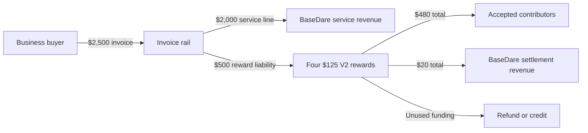

# BaseDare Revenue Architecture

Pricing authority: [`docs/FINANCIAL_CANON.md`](./FINANCIAL_CANON.md).

## Active revenue rails

### 1. Self-serve settlement

- Buyer funds a personal/community dare.
- V2 escrows the reward.
- A successful completion settles 96% to the completer and 4% to BaseDare.
- There is no V2 referral payout or Live Pot entitlement.
- BaseDare provides the protocol rail, not managed campaign delivery.

### 2. Managed Verified Field Sprint

- Buyer pays a $2,500 invoice.
- $2,000 is the managed-service line.
- $500 is a separately tracked creator reward pool.
- Four accepted $125 rewards pay creators $120 each and produce $20 total settlement revenue.
- BaseDare delivers scoping, routing, bounded verification/support, and a receipt.

The public buyer portal must lead to the invoice intake. Only an authorized internal path may register the managed campaign after payment confirmation. The V2 contract is used for creator rewards, not the service fee.

## Money flow

## Accounting boundaries

Count as company revenue:

- settled 4% platform fees;
- earned managed-service fees;
- future paid products only after they are live and separately measured.

Do not count as company revenue:

- funded GMV;
- creator payouts or unsettled reward pools;
- refunds and credits;
- treasury-funded dares;
- referral or Live Pot balances;
- grants as customer PMF.

## Parked architecture

The 25% all-in self-serve business rail is a future automated product, not a current price. Venue subscriptions, City Signal, API/data licensing, white-label settlement, boosted discovery, referral economics, and token economics remain parked until a real paid loop justifies them.

## Control rule

Any change to pricing or splits must update, in one reviewed change:

1. `docs/FINANCIAL_CANON.md`;
2. `lib/financial-canon.ts` and its tests;
3. contract constants/tests if settlement changes;
4. public buyer and creator copy;
5. dashboard revenue definitions and release runbooks.
